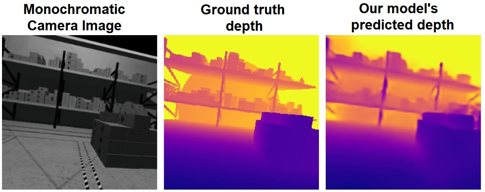

# CrazyFlie With Monocular Depth Estimation Model



## Downloading the repository

Clone the repository into `~/crazyflie_sim_shared` directory:

```Shell
git clone https://github.com/mmcza/CrazyFlie-With-Depth-Image-Model/ ~/crazyflie_sim_shared
```

## Build the Docker image

```Shell
docker build . -t crazyflie_simulator
```
\* (Information only if you're interested in using the package with Depth Estimation Model) for some reason a duplicate of the `cv_bridge` package is not uninstalled when the image is being built and requires to run `pip uninstall cv_bridge` after starting the container 

## Start the container

To start the container simply run:
```Shell
bash start_container.sh
```

To enter the container from another terminal you can use:
```Shell
docker exec -ti crazyflie-sim bash
```

## Fly around with the drone

```Shell
cd Shared/crazyflie_mapping_demo/ros2_ws/
```

```Shell
colcon build --symlink-install && source install/setup.bash
```

```Shell
ros2 launch crazyflie_ros2_multiranger_bringup simple_mapper_simulation.launch.py
```

In second terminal
```Shell
ros2 run teleop_twist_keyboard teleop_twist_keyboard
```

## Estimate the depth image
Insert the model into `depth_estimation_model` and name it `depth-estimation_model.onnx` (or change path inside `/crazyflie_mapping_demo/ros2_ws/depth-estimation/depth-estimation/depth-estimation_node.py`)

To run with GPU:
```Shell
ros2 run depth_estimation depth_estimation
```

## Set position of the drone

```Shell
gz service -s /world/empty/set_pose --reqtype gz.msgs.Pose --reptype gz.msgs.Boolean --timeout 300 -r "name: 'crazyflie', position: {x: -1.0, y: -1.0, z: 1.0}, orientation: {x: 0.0, y: 0.0, z: 0.0, w: 1.0}"
```

[Link](https://github.com/gazebosim/gz-msgs/blob/gz-msgs11/proto/gz/msgs/pose.proto) to Pose message declaration

## Collect training data

To run in `the world_cafe_1.sdf` (adjust the `num_of_files` to the desired number of pictures)

```Shell
ros2 run crazyflie_data_collector data_collector --ros-args -p min_x:=-4.75 -p max_x:=4.0 -p min_y:=-10.5 -p max_y:=11.5 -p min_z:=0.1 -p max_z:=2.50 -p num_of_files:=10 -p output_path:="/root/Shared/crazyflie_images/"
```

For `world_warehouse_1.sdf`

```Shell
ros2 run crazyflie_data_collector data_collector --ros-args -p min_x:=-6.25 -p max_x:=6.25 -p min_y:=-9.5 -p max_y:=9.5 -p min_z:=0.1 -p max_z:=8.50 -p num_of_files:=1000 -p output_path:="/root/Shared/neural_network_model/crazyflie_images/warehouse/"
```

## To run the `data_viewer.py` script, use the following command in the terminal:

```bash
python data_viewer.py
```

## Model training

### Install the required packages

Install the required packages by running the following command:

```Shell
pip install -r requirements.txt
```

Check the CUDA version of your GPU and install the appropriate version of PyTorch from the [official website](https://pytorch.org/get-started/locally/).

### Start the training

To start the training, run the following commands:

```Shell
  python train.py --model unet_resnet34
  python train.py --model unet_cbam

```
## Depth Loss Function

In this project, the loss function for depth estimation is designed to combine multiple components that balance pixel-wise accuracy, perceptual similarity, and spatial smoothness. 

### Components of the Loss Function

The **Depth Loss** combines three key components:

1. **L1 Loss**:  
   The L1 Loss measures the mean absolute error (MAE) between the predicted depth map (\(\hat{D}\)) and the ground truth depth map (\(D\)). 

$$
\mathcal{L}_{\text{L1}} = \text{mean}(|\hat{D} - D|)
$$

2. **SSIM Loss**:  
   The Structural Similarity Index (SSIM) Loss evaluates the perceptual similarity between the predicted and ground truth depth maps. The SSIM Loss is defined as:

   \[
   \mathcal{L}_{\text{SSIM}} = 1 - \text{SSIM}(\hat{D}, D)
   \]

   Here, \(\text{SSIM}(\hat{D}, D)\) computes the structural similarity index over the depth maps.

3. **Smoothness Loss**:  
   To encourage spatial consistency and reduce noise in the predicted depth maps, a smoothness loss penalizes large gradients in the depth predictions. The smoothness loss is defined as:

   \[
   \mathcal{L}_{\text{Smooth}} = \frac{1}{N} \sum_{i,j} \left| \frac{\partial \hat{D}}{\partial x} \right| + \left| \frac{\partial \hat{D}}{\partial y} \right|
   \]

   where \(N\) is the total number of pixels, and \(\frac{\partial \hat{D}}{\partial x}\) and \(\frac{\partial \hat{D}}{\partial y}\) are the gradients of the predicted depth map along the \(x\) and \(y\) axes, respectively.

### Combined Loss Function

The final loss function combines these components using a weighted sum. A hyperparameter \(\alpha\) determines the balance between L1 Loss and SSIM Loss, while the Smoothness Loss is added as a regularization term:

\[
\mathcal{L} = (1 - \alpha) \cdot \mathcal{L}_{\text{L1}} + \alpha \cdot \mathcal{L}_{\text{SSIM}} + \mathcal{L}_{\text{Smooth}}
\]
